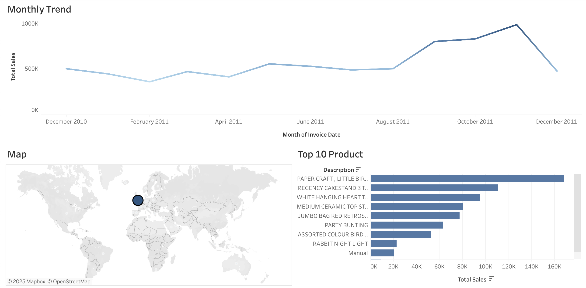

# E-Commerce Sales Analysis
An end-to-end E-Commerce data analysis project featuring data cleaning with Python (Pandas) and interactive dashboard design using Tableau. (Focus: Seasonal Trends & Customer Analytics)

## 📊 Project Output (Dashboard)

Click the image below to access the interactive Tableau Dashboard:

👉 **[Click Here to Explore the Live Dashboard](https://public.tableau.com/app/profile/kerem.baydar/viz/E-CommerceSalesAnalysis2025/Dashboard1?publish=yes&showOnboarding=true)**
